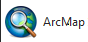
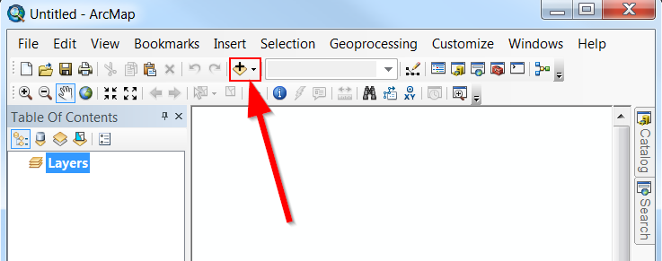
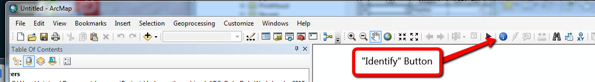

# GIS and Python  (~20 minutes)

ArcMap is a GIS for visualizing and analyzing data.  

Data preparation: Download [chilePics.zip](https://drive.google.com/file/d/1Y-IzaKyDzhxHhgOHhwpTBZ0afLWaXERP/view?usp=sharing) and unzip it in C:/gispy/scratch so that C:/gispy/scratch/chilePics/EnchantedForest/P1010417.JPG exists. 

Open ArcMap <br>


## 1. Play with Python in a GIS
Open the Python Window in ArcMap


  Type each of the following lines of code at the *Python prompt* and observe the result:

```Python

print('Hello')

5 + 6

x = 8

print(x)

x  

import os

arcpy.Exists('C:/gispy/scratch/chilePics/EnchantedForest/P1010417.JPG') # should say True.  If not, raise your hand!
```
## 2. Add a basemap

1. Click the small arrow on the right side of the "Add Data" button.


2. Select "Add Basemap"

3. Select "National Geographic"

## 3. Add points to the map.
Now we're going to map geotagged photos.  

1. First, we need to tell Python where the images are.  Copy the following into the Python Window and hit Enter:

```Python
myPicFolder = "C:/gispy/scratch/chilePics/EnchantedForest/"
```
2. Then we can call an ArcGIS tool "GeoTagged Photos to Points".   Copy the following into the Python Window and hit Enter:
```Python
arcpy.GeoTaggedPhotosToPoints_management(myPicFolder)
```
3. Do you see any new points?  Look for the new layer in the table of contents.  Right click on the layer and select "Zoom to layer"
4. Cick the "Identify" button <br>
  <br>
5. Click on one of the points you've added to the map. Inspect the values.<br>
6. Click on the image "Path" in the identify box. The path might be something like this:<br>  <i>C:/gispy/scratch/chilePics/EnchantedForest/trees.JPG</i> <br>  
Clicking on the path will open the image!  Does the forest look enchanted?

## 4. Add points to the map.

Now add a lot more photos from different folders all at once. Copy the following into the Python Window and hit Enter:
```Python
import os

myFolder = "C:/gispy/scratch/chilePics/chile/"

myDirs = os.listdir(myFolder)

for d in myDirs:
    arcpy.GeoTaggedPhotosToPoints_management(myFolder + d)
```
